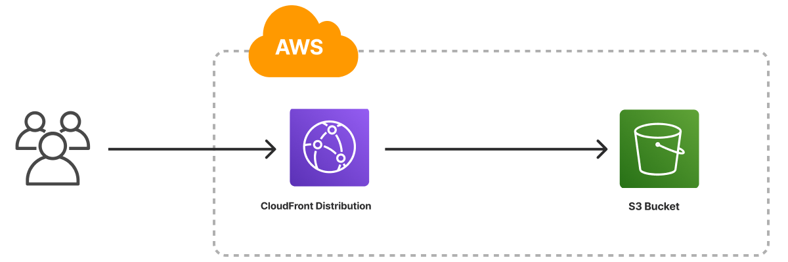

The Static Website template deploys an HTML website on AWS. It uses an [Amazon S3 bucket]() for file storage, configures the bucket to host a static website, and deploys an [Amazon CloudFront Distribution]() (CDN) to serve the website with low latency, caching, and HTTPS. The template also ships with placeholder web content to give you a working Pulumi project out of the box that you can customize easily and extend to suit your needs.



## Create a new static website project

To use this template, start by [installing Pulumi]() and [configuring your AWS credentials](), then create new [project]() from the template in your language of choice. You can do this either by following a link to create the project in the Pulumi Service:



Or by choosing a language and deploying the project with the Pulumi CLI:

{}

{}

```bash
$ mkdir my-site && cd my-site
$ pulumi new static-website-aws-typescript
```

{}

{}

```bash
$ mkdir my-site && cd my-site
$ pulumi new static-website-aws-python
```

{}

{}

```bash
$ mkdir my-site && cd my-site
$ pulumi new static-website-aws-go
```

{}

{}

```bash
$ mkdir my-site && cd my-site
$ pulumi new static-website-aws-csharp
```

{}

{}

```bash
$ mkdir my-site && cd my-site
$ pulumi new static-website-aws-yaml
```

{}

Follow the prompts to complete the new-project wizard. When it's done, you're ready to deploy.

## Configure the project

Optionally, you can [configure]() the Static Website template by adjusting the following settings:

path
: The path to the folder containing the files of the website. Defaults to `www`, which is the name (and relative path) of the folder included with the template.

indexDocument
: The file to use for top-level pages. Defaults to `index.html`.

errorDocument
: The file to use for error pages. Defaults to `error.html`.

None of these settings is required; by default, the Static Website template is set up to deploy the website using the files contained in the `www` folder that's bundled with the template.

## Deploy the project

Deploy the website by running [`pulumi up`](), which renders a complete preview of all the AWS resources to be deployed:

```bash
$ pulumi up
```

When the deployment completes, you'll notice Pulumi reports the following [stack outputs]():

originHostname
: The provider-assigned hostname of the S3 bucket.

originURL
: The fully-qualified HTTP URL of the S3 bucket endpoint.

cdnHostname
: The provider-assigned hostname of the CloudFront CDN. Useful for creating `CNAME` records to associate custom domains.

cdnURL
: The fully-qualified HTTPS URL of the CloudFront CDN.

Stack outputs are useful in a number of ways, most commonly as inputs to other stacks or cloud resources. The computed `cdnHostname`, for instance, can be passed as an argument to a DNS record resource to give your website a custom domain name. See the [Next Steps](#next-steps) section on this page for an example.

## Customize the project

### Bring your own web content

If you already have a website you'd like to deploy, you can do so by replacing contents of the `www` folder and redeploying with `pulumi up`.

Alternatively, you can configure the stack to deploy from another folder on your machine by using [`pulumi config set`]() to change the value of the `path` setting:

```bash
$ pulumi config set path ../my-website/dist
$ pulumi up
```

## Next steps

(...)

### Add a custom domain

You can also easily add a custom domain for your website. (...)

#### Use a domain managed with Amazon Route 53

If the domain you'd like to use is being managed with Amazon Route 53, you can associate the domain with your website by adding a `route53.Record` to map a new subdomain to the CloudFront CDN provisioned earlier. Add the following code to your program



{}

```typescript
// ...
const domain = config.require("domain");
const subdomain = config.require("subdomain");

// Look up your existing Route 53-managed done.
const zone = aws.route53.getZone({ name: domain });

// Create a DNS A record to point to the website.
const record = new aws.route53.Record(`${subdomain}.${domain}`, {
    name: subdomain,
    zoneId: zone.then(zone => zone.zoneId),
    type: "A",
    aliases: [
        {
            name: cdn.domainName,
            zoneId: cdn.hostedZoneId,
            evaluateTargetHealth: true,
        }
    ],
});
```

{}

{}

```python
# Look up an existing Route 53-managed zone.
zone = aws.route53.get_zone(name="example.com")

# Create a DNS A record to point to the CDN.
my_site = aws.route53.Record("www",
    zone_id=zone.zone_id,
    name="www.example.com",
    type="A",
    aliases=[aws.route53.RecordAliasArgs(
        name=cdn.domain_name,
        zone_id=cdn.hosted_zone_id,
        evaluate_target_health=True,
    )])
```

{}

{}

```go
// Look up an existing Route 53-managed zone.
zone, err := route53.LookupZone(ctx, &route53.LookupZoneArgs{
    Name: pulumi.StringRef("example.com"),
}, nil)
if err != nil {
    return err
}

// Create a DNS A record to point to the CDN.
mySite, err := route53.NewRecord(ctx, "www", &route53.RecordArgs{
	ZoneId: pulumi.String(zone.ZoneId),
	Name:   pulumi.String("www.example.com"),
	Type:   pulumi.String("A"),
	Aliases: route53.RecordAliasArray{
		&route53.RecordAliasArgs{
			Name:                 cdn.DomainName,
			ZoneId:               cdn.HostedZoneId,
			EvaluateTargetHealth: pulumi.Bool(true),
		},
	},
})
if err != nil {
	return err
}
```

{}

{}

```csharp
// Look up an existing Route 53-managed zone.
var zone = Aws.Route53.GetZone.Invoke(new()
{
    Name = "example.com",
});

// Create a DNS A record to point to the CDN.
var mySite = new Aws.Route53.Record("www", new()
{
    ZoneId = zone.Apply(getZoneResult => getZoneResult.ZoneId),
    Name = "www.example.com",
    Type = "A",
    Aliases = new[]
    {
        new Aws.Route53.Inputs.RecordAliasArgs
        {
            Name = cdn.DomainName,
            ZoneId = cdn.HostedZoneId,
            EvaluateTargetHealth = true,
        },
    },
});
```

{}

{}

```yaml
variables:

  # Look up an existing Route 53-managed zone.
  zone:
    Fn::Invoke:
      Function: aws:route53:getZone
      Arguments:
        name: "example.com"

resources:

  # Create a DNS A record to point to the CDN.
  www:
    type: aws:route53:Record
    properties:
      zoneId: ${zone.zoneId}
      name: www.example.come
      type: A
      aliases:
        - name: ${cdn.domainName}
          zoneId: ${cdn.hostedZoneId}
          evaluateTargetHealth: true
```

{}

#### Use a domain managed with a third-party service

Alternatively, if the domain you'd like to use isn't being with Route 53, you can also use a different DNS provider. The following example demonstrates provider. The following example uses the Pulumi CloudFlare provider to create a CNAME record in CloudFlare using the S3 bucket's `websiteEndpoint`:



{}

```typescript
// Create a CloudFlare DNS entry to point to the website.
const cname = new cloudflare.Record("cname", {
    name: "www",
    zoneId: cloudflare.getZoneOutput({ name: "example.com" }).zoneId,
    type: "CNAME",
    value: bucket.websiteDomain,
    proxied: true,
});
```

{}
{}

```python

```

{}
{}

```go

```

{}
{}

```csharp

```

{}
{}

```yaml
variables:
  zone:
    Fn::Invoke:
      Function: cloudflare:index/getZone:getZone
      Arguments:
        name: "pulumibook.info"

resources:
  bucket:
    type: aws:s3:Bucket
    properties:
      acl: public-read
      bucket: www.example.com
      website:
        indexDocument: ${indexDocument}
        errorDocument: ${errorDocument}
  cname:
    type: cloudflare:Record
    properties:
      name: www
      zoneId: ${zone.zoneId}
      type: CNAME
      value: ${bucket.websiteDomain}
      proxied: true
```

{}

---

## More info

### What are static websites?

Static websites are an efficient and scalable way of building and serving web content with HTML, CSS, and JavaScript. Popular frameworks for building and managing static websites include Next.js, Hugo, Gatsby, and Jekyll.

With AWS, you can host a static website by configuring Amazon S3 for hosting and Amazon CloudFront as the CDN. You could also use AWS Amplify, which is designed for deploying static websites more easily.

### Benefits of Pulumi for static websites on AWS

Infrastructure as Code is an efficient and repeatable way of building a static website with programming languages and deploying the website to AWS.

Pulumi’s open source, infrastructure as code SDK that lets you build and deploy static websites with TypeScript/JavaScript, Python, Go, Java, .NET, and YAML. The main benefits include:

* **Programming Languages**: Define infrastructure as code in your favorite language instead of domain-specific languages or clicking through cloud consoles.

* **Easier Integration**: Integrate every cloud service needed to run your static website into a single program.

* **Fast, Easy Deployment**: Quickly deploy your static website with a CLI or from a CI/CD workflow.

* **Rapid Development**: Author, version, test, and release infrastructure changes just like software.
